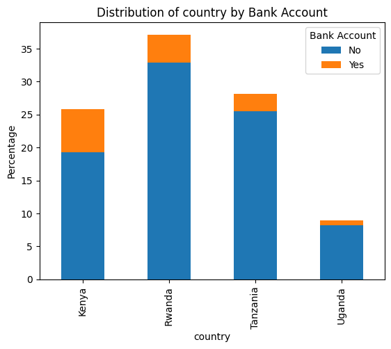
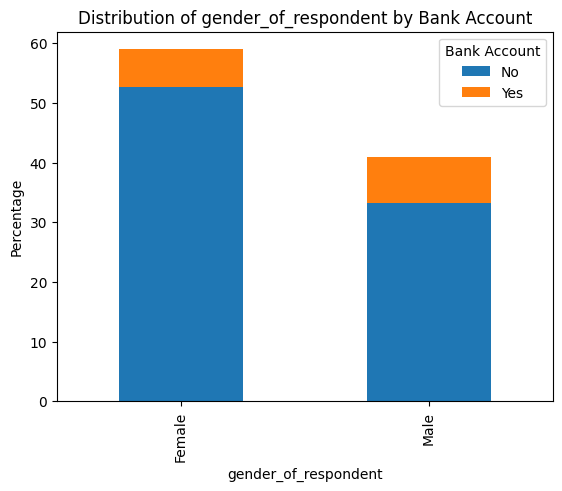
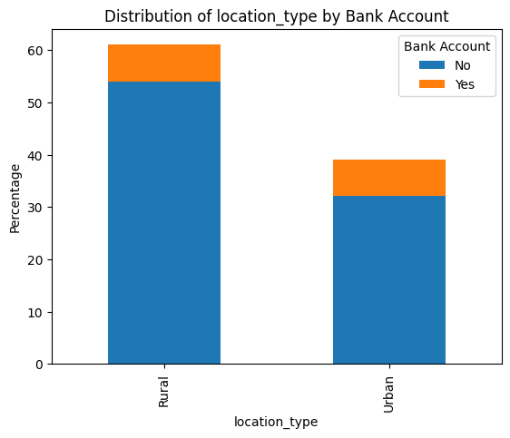

# UNLOCKING FINANCIAL INCLUSION IN EAST AFRICA.

## Team Members:
   1. Jeremy Ngugi
   2. Alice Mumbi
   3. Dennis Njogu
   4. Edwin Mwendwa
   5. Ronald Kipng'etich
   6. Thiga Margaret

## INTRODUCTION

In the changing environment of conventional banking throughout African countries, the need to expand operations is usually hindered by the practical challenge of determining the best places for opening new branches. Within this context, our project is strongly anchored in the identification of this difficulty, which has led us to the use of data analysis as a powerful instrument. Our main objective is to not just discover development opportunities, but also to greatly improve financial access across the continent. We hope to negotiate the complexity of the African banking market by applying data-driven insights wisely, opening the path for strategic development and demonstrable advances in financial inclusion.

## PROBLEM STATEMENT

The lack of financial inclusion in East Africa poses significant challenges to economic development and individual prosperity. In order to address this issue effectively, we aim to build a predictive model that can identify individuals without bank accounts. By leveraging various features such as demographic information, access to financial services, employment status, and education level, our model seeks to provide insights into the factors influencing financial inclusion. Ultimately, this model can assist policymakers, financial institutions, and NGOs in targeting interventions and initiatives to promote greater financial access and inclusion in the region.

## MAIN OBJECTIVE

- Geographic Analysis: Mapping regions with high demand for banking services across African countries.

## SPECIFIC OBJECTIVES

- Demographic Profiling: Understanding the demographic characteristics of target audiences, including age, income, and occupation.

- Accessibility Assessment: Evaluating the accessibility of banking services by considering factors such as distance to existing branches and transportation infrastructure.

- Employment Analysis: Examining employment trends in areas lacking bank branches to inform strategies for addressing economic needs and enhancing financial inclusion.

## NOTEBOOK STRUCTURE

- Reading the Data
- Data Cleaning
- Exploratory Data Analysis
- Data Preprocessing
- Modelling
- Training final model on full dataset
- Future Improvements
- Conclusions
- Recommendations

## DATA UNDERSTANDING 

  ### Data Source
The dataset utilized in this project was obtained from Zindi, a platform for data science competitions in Africa. It comprises responses from surveys conducted across East African nations, capturing information on bank account ownership, demographic characteristics, employment status, education level, and geographic location.
  ### Data Description:
- Country: The country where the survey was conducted.
- Year: The year in which the survey was conducted.
- Unique ID: A unique identifier assigned to each respondent.
- Bank Account: Binary variable indicating whether the respondent has a bank account or not.
- Location Type: Categorical variable specifying the type of location where the respondent resides (e.g., rural or urban).
- Cellphone Access: Binary variable indicating whether the respondent has access to a cellphone or not.
- Household Size: The number of individuals living in the respondent's household.
- Age of Respondent: The age of the respondent.
- Gender of Respondent: The gender of the respondent.
- Relationship with Head: The relationship of the respondent with the head of the household.
- Marital Status: The marital status of the respondent.
- Education Level: The highest level of education attained by the respondent.
- Job Type: The type of employment of the respondent.

## METHODOLOGY
  ### Data Preparation

- Cleaning:
Handling Missing Values: Any missing values in the dataset were addressed through appropriate imputation techniques. This ensured that the data used for analysis and modeling was complete and reliable.
Handling Duplicates: Duplicate entries, if any, were identified and removed from the dataset to maintain data integrity and prevent redundancy.

- One-Hot Encoding:
Categorical Variables: Categorical variables in the dataset, such as 'Location Type', 'Gender of Respondent', 'Marital Status', 'Education Level', and 'Job Type', were encoded using one-hot encoding technique. This transformed categorical variables into binary vectors, enabling them to be used as features in machine learning models.
Creation of Dummy Variables: Each category within a categorical variable was converted into a separate binary variable, with a value of 1 indicating the presence of that category and 0 indicating its absence. This allowed for the inclusion of categorical variables in predictive modeling without the need for ordinal encoding.

- Scaling and Data Balancing
Continuous variables were scaled to bring them to a similar range, preventing features with larger magnitudes from dominating the modeling process. 
Data Balancing with SMOTE: To tackle the class imbalance, we used Synthetic Minority Over-sampling Technique (SMOTE) to generate synthetic samples for the minority class (individuals with bank accounts), ensuring a balanced representation in the training data.

## EXPLORATORY DATA ANALYSIS

- Country against bank account:

    
- Gender against bank account:

    
- Location against bank account:

    

## MODELLING
In our analysis, we employed various machine learning algorithms to predict bank account ownership based on demographic and socioeconomic features. Specifically, we utilized K-Nearest Neighbors (KNN), Decision Trees, and Logistic Regression models.

- K-Nearest Neighbors (KNN):
Initially, we implemented a basic KNN model without hyperparameter tuning. The model achieved an accuracy of approximately 61% on unseen data. To enhance performance, we conducted hyperparameter tuning using GridSearchCV to find the optimal combination of hyperparameters. With the tuned model, the accuracy improved to approximately 88% on the test set.

- Decision Trees:
A Decision Tree classifier was trained on the preprocessed data. The model demonstrated an accuracy of approximately 89% on the test set. Hyperparameter tuning was conducted to optimize the model's performance. With the tuned model, the accuracy slightly improved to approximately 89% on the test set.

- Logistic Regression:
Logistic Regression was applied after scaling the features using StandardScaler. The model achieved an accuracy of approximately 87% on the test set. Model evaluation included precision, recall, accuracy, and F1-score metrics for both the training and testing sets.

## CONCLUSIONS

- Financial Inclusion Discrepancy: The analysis illuminates a significant disparity in financial inclusion levels across East Africa, with a predominant portion of respondents indicating an absence of bank account ownership. This underscores the imperative for concerted efforts aimed at dismantling existing barriers to access and fostering a more inclusive financial landscape.
- Educational Influence: Intriguingly, completion of primary or secondary education does not seem to substantially elevate the likelihood of possessing a bank account. This suggests that additional factors beyond educational attainment, such as accessibility to banking infrastructure and financial literacy, may wield greater influence over one's banking status.
- Employment Dynamics: A notable trend emerges regarding the impact of employment status on bank account ownership, with self-employed individuals comprising the largest share of respondents possessing bank accounts. This underscores the potential efficacy of tailored financial services and targeted support mechanisms geared towards various employment sectors in enhancing financial inclusion.
- Gender Disparity: There exists a palpable gender gap in bank account ownership, with males representing the majority of respondents with active bank accounts. Addressing gender-specific obstacles to financial access and implementing policies that prioritize gender equality in financial inclusion initiatives are paramount for fostering a more balanced financial landscape.
- Model Performance: The Logistic Regression model emerges as the best-performing model, exhibiting commendable precision and recall rates above 88%. Despite both models demonstrating robust predictive capabilities, the Logistic Regression model's slightly superior performance underscores its suitability for predicting bank account ownership in this context.

## RECOMMENDATIONS

1.	Targeted Expansion: Utilize the geographic analysis to identify regions with high demand for banking services and prioritize expansion efforts in these areas. This can help in increasing accessibility to banking services where they are most needed.
2.	Demographic Targeting: Use demographic profiling to tailor financial products and services to the specific needs and characteristics of different demographic groups. This can include age-appropriate financial education programs and customized banking solutions.
3.	Accessibility Improvement: Based on the accessibility assessment, consider investing in infrastructure improvements such as building new bank branches or enhancing transportation networks to make banking services more accessible to underserved communities.
4.	Employment-Based Strategies: Develop strategies to target different employment sectors identified in the analysis. For example, offering specialized financial products for self-employed individuals or providing financial literacy programs for farmers and fishermen.
5.	Gender-Specific Initiatives: Given the gender disparity in bank account ownership revealed in the analysis, implement targeted initiatives to promote financial inclusion among women. This could involve providing women with access to microfinance loans or creating women-focused financial empowerment programs.
